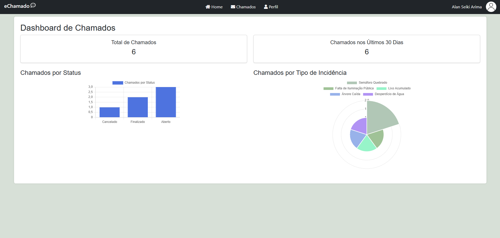
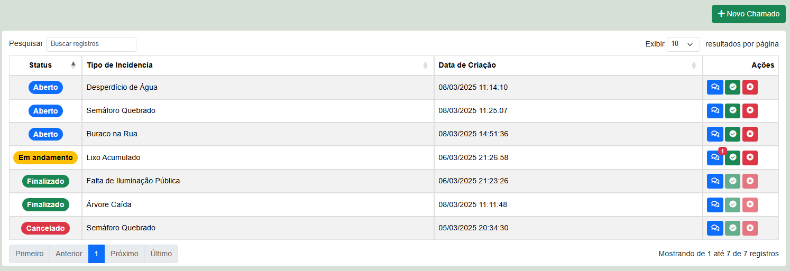
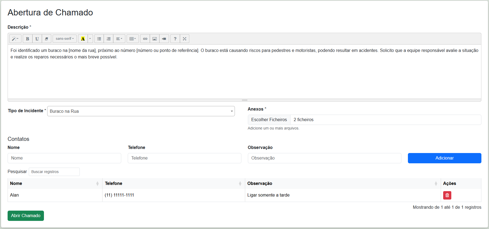
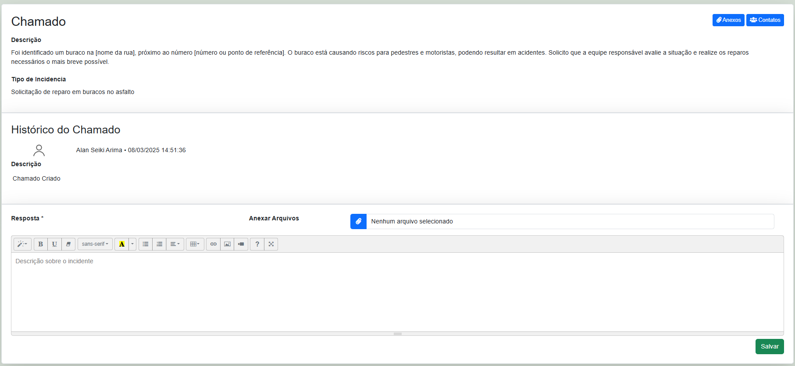

# eChamado

O projeto consiste no desenvolvimento de uma plataforma online para gestão de chamados de TI, permitindo que usuários registrem problemas técnicos, sugestões e incidentes. O objetivo é melhorar a comunicação entre a equipe de suporte e os colaboradores, garantindo um atendimento mais ágil e eficiente. Além disso, a implementação servirá como um teste prático de habilidades full-stack, utilizando tecnologias específicas.

## 📌 Funcionalidades  

✅ Gerenciamento de Chamados  
✅ Dashboard Interativo com Gráficos  
✅ Controle de Acesso por Tipo de Usuário  
✅ Integração com DataTables  

## 📷 Imagens do Projeto  

### 🔹 Tela Home  


### 🔹 Chamados  


### 🔹 Criar Chamado  


### 🔹 Chat do Chamado


## 🚀 Como Executar  

1. Clone o repositório:  
   ```sh
   git clone https://github.com/AlanSeiki/chamadosTIPrefeitura.git
   
2. Branch correta:
   ```sh
   git checkout chamadosti1.0.0

3. Criar o banco de dados:
  
    O SQL do banco está presente no `config/criacao_banco.sql`
     
5. Execulte o comando no seu terminal:
    ```sh
    php -S localhost:5000 -t public
